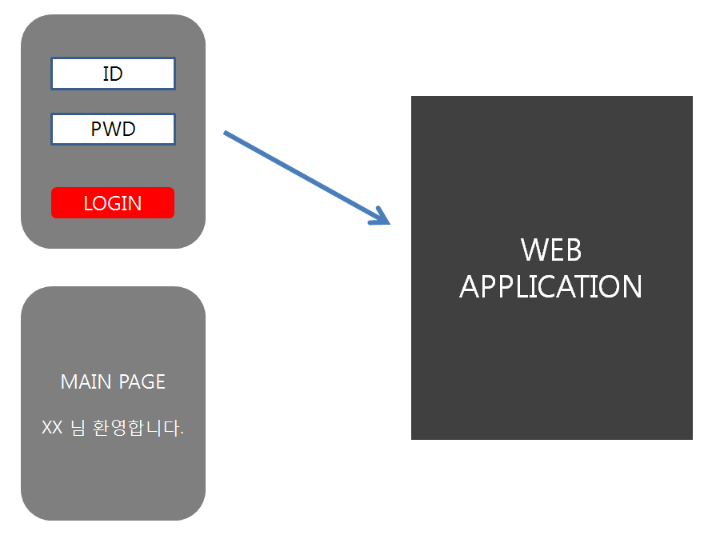
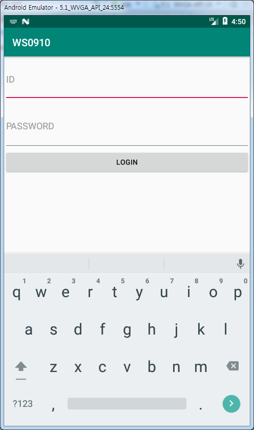
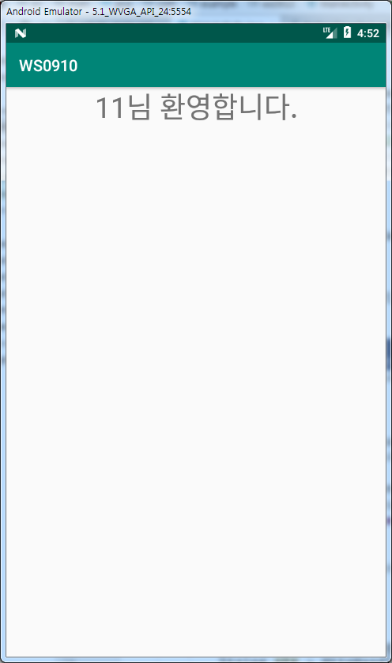
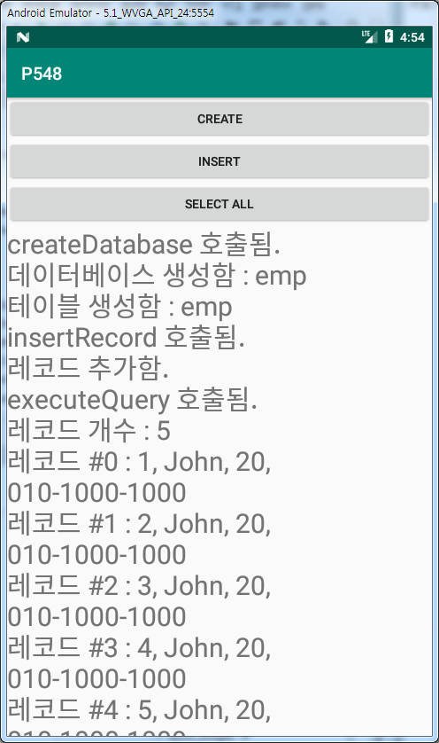
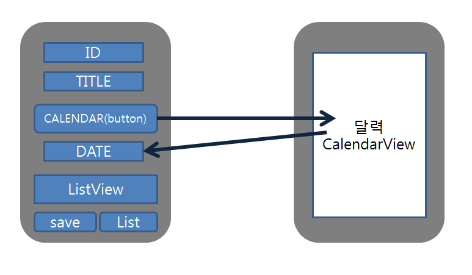
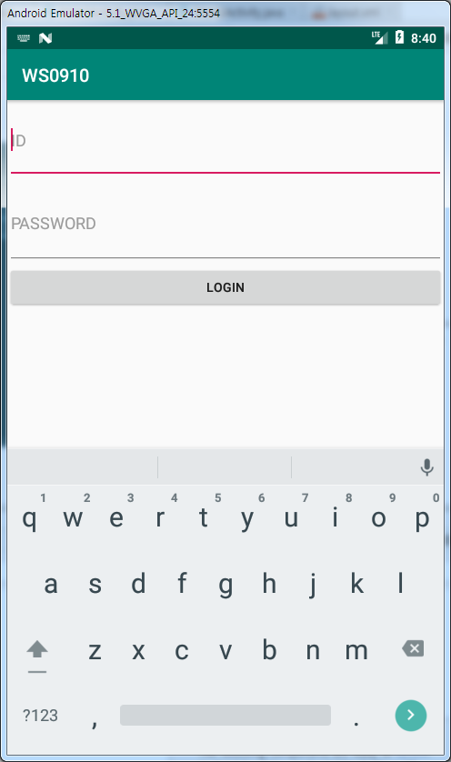
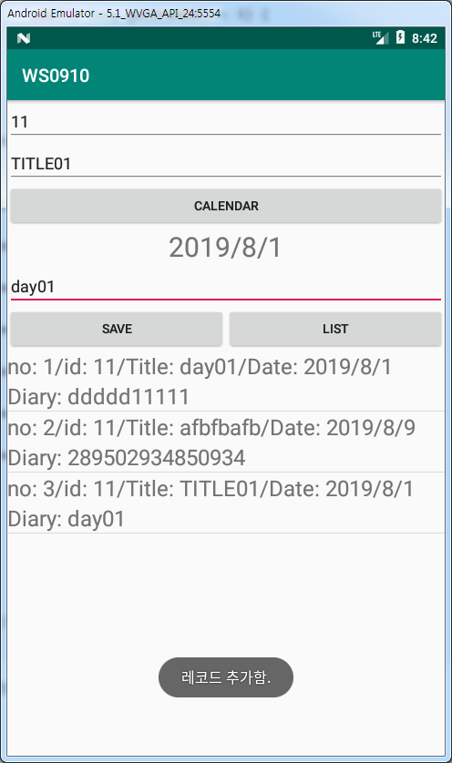
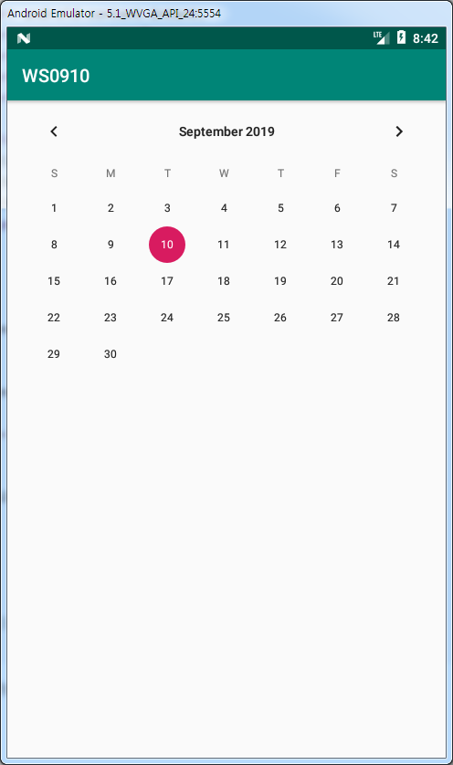

# 190910 데이터베이스 연동

모바일에서는 데이터베이스를 만들고 테이블을 추가한다.

### 로그인 - 데이터베이스

GET 방식으로 ID, PWD을 URL과 같이 Web application으로 보내서 

확인, JSP 하나 만들어서 request.getparameter 사용해서 하기

로그인 정보를 가져오기 위해 번들에 저장해서 보내주면 됨

web application에서 로그인 확인을 해주기 때문에 HttpHandler가 필요하다.

manifest에 INTERNET permission 추가하는 것 잊지 않기 




[MainActivity.java]

```java
package com.example.ws0910;

import androidx.annotation.NonNull;
import androidx.appcompat.app.AppCompatActivity;
import android.content.Intent;
import android.os.AsyncTask;
import android.os.Bundle;
import android.os.Handler;
import android.os.Message;
import android.view.LayoutInflater;
import android.view.View;
import android.widget.EditText;
import android.widget.Toast;

public class MainActivity extends AppCompatActivity {

    EditText editText, editText2;
    Intent intent;

    @Override
    protected void onCreate(Bundle savedInstanceState) {
        super.onCreate(savedInstanceState);
        setContentView(R.layout.activity_main);
        editText = findViewById(R.id.editText);
        editText2 = findViewById(R.id.editText2);
    }

    public  void clickBt(View view){
        sendData();
    }

    public void sendData(){
        String id = editText.getText().toString();
        String pwd = editText2.getText().toString();
        String url = "http://70.12.60.101/webex/login.jsp?id="+id+"&pwd="+pwd;
        Toast.makeText(MainActivity.this, url, Toast.LENGTH_SHORT).show();
        HttpTask httpTask = new HttpTask(url);
        httpTask.execute();
    }

    class HttpTask extends AsyncTask<String, String, String> {

        String url;

        public HttpTask(String url) {
            this.url = url;
        }
        @Override
        protected void onPreExecute() {
            Toast.makeText(MainActivity.this, url, Toast.LENGTH_SHORT).show();
        }

        @Override
        protected void onPostExecute(String s) {
            Toast.makeText(MainActivity.this, s, Toast.LENGTH_SHORT).show();
            if(s.equals("0")){
                intent = new Intent(getApplicationContext(), Main2Activity.class);
                intent.putExtra("id", editText.getText().toString());
                startActivity(intent);
            }else{
                //login fail
                Toast.makeText(MainActivity.this, "LOGIN FAIL", Toast.LENGTH_SHORT).show();
            }
        }

        @Override
        protected String doInBackground(String... strings) {
            String str = HttpHandler.getString(url);
            return str;
        }
    }
}
```

[activity_main.xml]



[Main2Activity.java]

```java
package com.example.ws0910;

import androidx.appcompat.app.AppCompatActivity;

import android.content.Intent;
import android.os.Bundle;
import android.widget.TextView;

public class Main2Activity extends AppCompatActivity {

    TextView textView2;
    @Override
    protected void onCreate(Bundle savedInstanceState) {
        super.onCreate(savedInstanceState);
        setContentView(R.layout.activity_main2);
        textView2 = findViewById(R.id.textView2);
        receiveData();

    }

    public void receiveData(){
        Intent intent = getIntent();
        String id = intent.getExtras().getString("id");
        //String pwd = intent.getExtras().getString("pwd");
        textView2.setText("MAIN PAGE");
        textView2.setText(id+"님 환영합니다.");
    }
}

```

[activity_main2.xml]



[Http.Handler.java]

```java
package com.example.ws0910;

import java.io.BufferedInputStream;
import java.io.BufferedReader;
import java.io.IOException;
import java.io.InputStream;
import java.io.InputStreamReader;
import java.net.HttpURLConnection;
import java.net.URL;

public class HttpHandler {
    public static String getString(String urlstr){
        //url을 받아서 연결해주는 함수
        String result = null;

        URL url = null;

        HttpURLConnection hcon = null;

        InputStream is = null;
        //서버에 접속해서 서버의 데이터를 받아오는 통로 역할

        BufferedReader br = null;

        try { //네트워크 연결하는 부분
            url = new URL(urlstr);
            hcon = (HttpURLConnection)url.openConnection();
            hcon.setConnectTimeout(10000);
            hcon.setRequestMethod("GET");
            //요청방식 설정
            is = hcon.getInputStream();
            //요청하는 단계, is에 결과값을 가져와서 뽑으면 됨
            result = converStr(is);

        } catch (Exception e) {
            e.printStackTrace();
        }finally {
            hcon.disconnect(); //반드시 연결 끊어주기
        }
        return result;
    }

    public static String converStr(InputStream is){
        //InputStream is에서 값을 가져오는 함수
        //가져온 것을 String으로 만들어서 반환해준다.

        String result = null;
        BufferedReader br = null;
        br = new BufferedReader(new InputStreamReader(is));
        StringBuilder sb = new StringBuilder();

        String temp;
        try{
            while((temp = br.readLine()) != null){
                sb.append(temp);
                //sb는 계속 append 될 수 있는 변수
            }
        }catch (Exception e){
            e.printStackTrace();
        }finally {
            try {
                is.close();//반드시 연결 끊어주기
            } catch (IOException e) {
                e.printStackTrace();
            }
        }
        return sb.toString();
    }
}
```


## 데이터베이스 및 테이블 생성

### P548

[MainActivity.java]

```java
package com.example.p548;

import androidx.appcompat.app.AppCompatActivity;
import android.database.Cursor;
import android.database.sqlite.SQLiteDatabase;
import android.os.Bundle;
import android.view.View;
import android.widget.TextView;

public class MainActivity extends AppCompatActivity {

    TextView textView;
    DatabaseHelper dbHelper;
    SQLiteDatabase database;

    @Override
    protected void onCreate(Bundle savedInstanceState) {
        super.onCreate(savedInstanceState);
        setContentView(R.layout.activity_main);
        textView = findViewById(R.id.textView);
    }

    public void create(View view){
        //데이터 베이스 생성 후 테이블 생성
        String name = "emp";
        println("createDatabase 호출됨.");

        //헬퍼객체 생성
        dbHelper = new DatabaseHelper(this);
        database = dbHelper.getWritableDatabase();
        println("데이터베이스 생성함 : " + name);

        if (database == null) {
            println("데이터베이스를 먼저 생성하세요.");
            return;
        }
        database.execSQL("create table if not exists " + name + "("
                + " _id integer PRIMARY KEY autoincrement, "
                + " name text, "
                + " age integer, "
                + " mobile text)");
        println("테이블 생성함 : " + name);

    }

    public void insert(View view){
        println("insertRecord 호출됨.");
        if (database == null) {
            println("데이터베이스를 먼저 생성하세요.");
            return;
        }
//        if (tableName == null) {
//            println("테이블을 먼저 생성하세요.");
//            return;
//        }
        database.execSQL("insert into emp"
                + "(name, age, mobile) "
                + " values "
                + "('John', 20, '010-1000-1000')");
        println("레코드 추가함.");
    }

    public void select(View view){
        println("executeQuery 호출됨.");
        Cursor cursor = database.rawQuery("select _id, name, age, mobile from emp", null);
        int recordCount = cursor.getCount();
        println("레코드 개수 : " + recordCount);

        for (int i = 0; i < recordCount; i++) {
            cursor.moveToNext();
            int id = cursor.getInt(0);
            String name = cursor.getString(1);
            int age = cursor.getInt(2);
            String mobile = cursor.getString(3);

            println("레코드 #" + i + " : " + id + ", " + name + ", " + age + ", " + mobile);
        }
        cursor.close();

    }


    public void println(String data) {
        textView.append(data + "\n");
    }

}
```

[DatabaseHelper.java]

```java
package com.example.p548;

import android.content.Context;
import android.database.sqlite.SQLiteDatabase;
import android.database.sqlite.SQLiteOpenHelper;
import android.util.Log;


//데이터베이스 생성, 테이블 생성 해주는 클래스
//create database, table class
public class DatabaseHelper extends SQLiteOpenHelper {
    public static String NAME = "employee.db";
    //database name (=oracle workspace)
    public static int VERSION = 1;
    //database version

    public DatabaseHelper(Context context) {
        //context = mainactivity info(정보들어가있음)
        super(context, NAME, null, VERSION);
    }

    public void onCreate(SQLiteDatabase db) {
        println("onCreate 호출됨");
        //
        String sql = "create table if not exists emp("
                + " _id integer PRIMARY KEY autoincrement, "
                + " name text, "
                + " age integer, "
                + " mobile text)";

        db.execSQL(sql);
    }

    public void onOpen(SQLiteDatabase db) {
        println("onOpen 호출됨");
    }

    public void onUpgrade(SQLiteDatabase db, int oldVersion, int newVersion) {
        //1. delete -> 2. new insert , 삭제하고 다시 만듬
        println("onUpgrade 호출됨 : " + oldVersion + " -> " + newVersion);

        if (newVersion > 1) {
            db.execSQL("DROP TABLE IF EXISTS emp");
        }
    }

    public void println(String data) {
        Log.d("DatabaseHelper", data);
    }
}
```

[activity_main.xml]




## 내용 제공자(Content Provider)

- 한 앱에서 관리하는 데이터를 다른 앱에서도 접근할 수 있도록 해준다.

- 다른 앱에게 데이터 접근 통로를 열어줄 수 있다.

- 주의할 점은 반드시 허용된 통로로만 접근해야 한다.

### SampleAlbum

```
<uses-permission android:name="android.permission.READ_EXTERNAL_STORAGE"/>
```

- 갤러리에 접근하겠다.

---

```
AutoPermissions.Companion.loadAllPermissions(this, 101);
```

- 모든 Permission 다 열음

[MainActivity.java]

```java
package org.techtown.album;

import android.Manifest;
import android.content.ContentResolver;
import android.content.Intent;
import android.content.pm.PackageManager;
import android.graphics.Bitmap;
import android.graphics.BitmapFactory;
import android.net.Uri;
import android.support.v4.app.ActivityCompat;
import android.support.v4.content.ContextCompat;
import android.support.v7.app.AppCompatActivity;
import android.os.Bundle;
import android.util.Log;
import android.view.View;
import android.widget.Button;
import android.widget.ImageView;
import android.widget.Toast;

import com.pedro.library.AutoPermissions;
import com.pedro.library.AutoPermissionsListener;

import org.jetbrains.annotations.NotNull;

import java.io.FileNotFoundException;
import java.io.IOException;
import java.io.InputStream;
import java.util.ArrayList;

public class MainActivity extends AppCompatActivity implements AutoPermissionsListener {

    ImageView imageView;

    @Override
    protected void onCreate(Bundle savedInstanceState) {
        super.onCreate(savedInstanceState);
        setContentView(R.layout.activity_main);
        imageView = findViewById(R.id.imageView);
        Button button = findViewById(R.id.button);
        button.setOnClickListener(new View.OnClickListener() {
            @Override
            public void onClick(View v) {
                openGallery();
            }
        });
        AutoPermissions.Companion.loadAllPermissions(this, 101);
    }

    public void openGallery() {
        //image request
        //image 가져오겠다고 요청
        Intent intent = new Intent();
        intent.setType("image/*");
        intent.setAction(Intent.ACTION_GET_CONTENT);
        startActivityForResult(intent, 101);
        //이 다음에 onActivityResult()로 간다.
    }

    @Override
    protected void onActivityResult(int requestCode, int resultCode, Intent data) {
        if(requestCode == 101) {
            if(resultCode == RESULT_OK) {
                Uri fileUri = data.getData();
                ContentResolver resolver = getContentResolver();
                try {
                    InputStream instream = resolver.openInputStream(fileUri);
                    Bitmap imgBitmap = BitmapFactory.decodeStream(instream);
                    imageView.setImageBitmap(imgBitmap);
                    instream.close();
                } catch(Exception e) {
                    e.printStackTrace();
                }
            }
        }
    }

    @Override
    public void onRequestPermissionsResult(int requestCode, String permissions[],
                                           int[] grantResults) {
        super.onRequestPermissionsResult(requestCode, permissions, grantResults);
        AutoPermissions.Companion.parsePermissions(this, requestCode, permissions, this);
    }

    @Override
    public void onDenied(int requestCode, @NotNull String[] permissions) {
        Toast.makeText(this, "permissions denied : " + permissions.length,
                Toast.LENGTH_LONG).show();
    }

    @Override
    public void onGranted(int requestCode, @NotNull String[] permissions) {
        Toast.makeText(this, "permissions granted : " + permissions.length, Toast.LENGTH_LONG).show();
    }
}
```


[AndroidManifest.xml]

```xml
<?xml version="1.0" encoding="utf-8"?>
<manifest xmlns:android="http://schemas.android.com/apk/res/android"
    package="org.techtown.album">

    <uses-permission android:name="android.permission.READ_EXTERNAL_STORAGE"/>

    <application
        android:allowBackup="true"
        android:icon="@mipmap/ic_launcher"
        android:label="@string/app_name"
        android:roundIcon="@mipmap/ic_launcher_round"
        android:supportsRtl="true"
        android:theme="@style/AppTheme">
        <activity android:name=".MainActivity">
            <intent-filter>
                <action android:name="android.intent.action.MAIN" />

                <category android:name="android.intent.category.LAUNCHER" />
            </intent-filter>
        </activity>
    </application>

</manifest>
```


### SampleContacts

```
<uses-permission android:name="android.permission.READ_CONTACTS" /><uses-permission android:name="android.permission.WRITE_CONTACTS" />
```

- 읽거나 수정가능

[MainActivity.java]

```java
package org.techtown.contacts;

import android.content.Intent;
import android.database.Cursor;
import android.net.Uri;
import android.provider.ContactsContract;
import android.support.v7.app.AppCompatActivity;
import android.os.Bundle;
import android.util.Log;
import android.view.View;
import android.widget.Button;
import android.widget.TextView;
import android.widget.Toast;

import com.pedro.library.AutoPermissions;
import com.pedro.library.AutoPermissionsListener;

import org.jetbrains.annotations.NotNull;

public class MainActivity extends AppCompatActivity implements AutoPermissionsListener {
    TextView textView;

    @Override
    protected void onCreate(Bundle savedInstanceState) {
        super.onCreate(savedInstanceState);
        setContentView(R.layout.activity_main);

        textView = findViewById(R.id.textView);

        Button button = findViewById(R.id.button);
        button.setOnClickListener(new View.OnClickListener() {
            @Override
            public void onClick(View v) {
                chooseContacts();
            }
        });

        AutoPermissions.Companion.loadAllPermissions(this, 101);
    }

    @Override
    public void onRequestPermissionsResult(int requestCode, String permissions[],
                                           int[] grantResults) {
        super.onRequestPermissionsResult(requestCode, permissions, grantResults);
        AutoPermissions.Companion.parsePermissions(this, requestCode, permissions, this);
    }

    @Override
    public void onDenied(int requestCode, @NotNull String[] permissions) {
        Toast.makeText(this, "permissions denied : " + permissions.length,
                Toast.LENGTH_LONG).show();
    }

    @Override
    public void onGranted(int requestCode, @NotNull String[] permissions) {
        Toast.makeText(this, "permissions granted : " + permissions.length, Toast.LENGTH_LONG).show();
    }

    public void chooseContacts() {
        Intent contactPickerIntent = new Intent(Intent.ACTION_PICK,
                ContactsContract.Contacts.CONTENT_URI);
        startActivityForResult(contactPickerIntent,101);
    }

    @Override
    protected void onActivityResult(int requestCode, int resultCode, Intent data) {
        if (resultCode == RESULT_OK) {
            if (requestCode == 101) {
                try {
                    Uri contactsUri = data.getData();
                    String id = contactsUri.getLastPathSegment();

                    getContacts(id);
                } catch (Exception e) {
                    e.printStackTrace();
                }
            }
        }
    }

    public void getContacts(String id) {
        Cursor cursor = null;
        String name = "";

        try {
            cursor = getContentResolver().query(ContactsContract.Data.CONTENT_URI,
                    null,
                    ContactsContract.Data.CONTACT_ID + "=?",
                    new String[] { id },
                    null);

            if (cursor.moveToFirst()) {
                name = cursor.getString(cursor.getColumnIndex(ContactsContract.Data.DISPLAY_NAME));
                println("Name : " + name);

                // 모든 칼럼 이름 확인
                String columns[] = cursor.getColumnNames();
                for (String column : columns) {
                    int index = cursor.getColumnIndex(column);
                    String columnOutput = ("#" + index + " -> [" + column + "] " + cursor.getString(index));
                    println(columnOutput);
                }
                cursor.close();
            }
        } catch (Exception e) {
            e.printStackTrace();
        }
    }

    public void println(String data) {
        textView.append(data + "\n");
    }
}
```

[AndroidManifest.xml]

```xml
<?xml version="1.0" encoding="utf-8"?>
<manifest xmlns:android="http://schemas.android.com/apk/res/android"
    package="org.techtown.contacts">

    <uses-permission android:name="android.permission.READ_CONTACTS" />
    <uses-permission android:name="android.permission.WRITE_CONTACTS" />

    <application
        android:allowBackup="true"
        android:icon="@mipmap/ic_launcher"
        android:label="@string/app_name"
        android:roundIcon="@mipmap/ic_launcher_round"
        android:supportsRtl="true"
        android:theme="@style/AppTheme">
        <activity android:name=".MainActivity">
            <intent-filter>
                <action android:name="android.intent.action.MAIN" />

                <category android:name="android.intent.category.LAUNCHER" />
            </intent-filter>
        </activity>
    </application>

</manifest>
```


### WorkShop 0910



로그인 후 메인 화면을 위 화면으로 수정

로그인 하여 ID를 가져와서 ID 칸에 넣고

TITLE은 사용자가 입력

CALENDAR는 버튼 클릭시 다른 달력 액티비티로 이동하여 날짜선택한 후

아래 DATE 칸에 선택한 날짜 출력

SAVE 누르면 생성된 SQLite 테이블 안에 insert가 되어서 들어감

SAVE 클릭은 insert라고 생각하면 된다.

LIST는 select 구문이 실행된다. Adapter를 이용해서 ListView에 표현하면된다.

#### 주의

- SQLite에 문자열 넣을 때 '문자열'로 감싸줘서 넣어야 한다.

- 만일 해도 안되면 앱 지웠다가 다시 실행하면 된다.

#### 수정할 부분

- LIST 누를 때 마다 초기화 후에 출력하게 만드는 기능
- detail 부분 완성하기

[MainActivity.java]

```java
package com.example.ws0910;

import androidx.annotation.NonNull;
import androidx.appcompat.app.AppCompatActivity;

import android.content.Intent;
import android.os.AsyncTask;
import android.os.Bundle;
import android.os.Handler;
import android.os.Message;
import android.view.LayoutInflater;
import android.view.View;
import android.widget.EditText;
import android.widget.Toast;

public class MainActivity extends AppCompatActivity {

    EditText editText, editText2;
    Intent intent;

    @Override
    protected void onCreate(Bundle savedInstanceState) {
        super.onCreate(savedInstanceState);
        setContentView(R.layout.activity_main);
        editText = findViewById(R.id.editText);
        editText2 = findViewById(R.id.editText2);
    }

    public  void clickBt(View view){
        sendData();
    }

    public void sendData(){
        String id = editText.getText().toString();
        String pwd = editText2.getText().toString();
        //Toast.makeText(MainActivity.this, id+" "+pwd, Toast.LENGTH_SHORT).show();
        String url = "http://70.12.60.101/webex/login.jsp?id="+id+"&pwd="+pwd;
        //Toast.makeText(MainActivity.this, url, Toast.LENGTH_SHORT).show();
        HttpTask httpTask = new HttpTask(url);
        httpTask.execute();
    }

    class HttpTask extends AsyncTask<String, String, String> {

        String url;

        public HttpTask(String url) {
            this.url = url;
        }
        @Override
        protected void onPreExecute() {
            //Toast.makeText(MainActivity.this, url, Toast.LENGTH_SHORT).show();
        }

        @Override
        protected void onPostExecute(String s) {
            //Toast.makeText(MainActivity.this, s, Toast.LENGTH_SHORT).show();
            if(s.equals("0")){
                intent = new Intent(getApplicationContext(), Main2Activity.class);
                intent.putExtra("id", editText.getText().toString());
                startActivity(intent);
            }else{
                //login fail
                Toast.makeText(MainActivity.this, "LOGIN FAIL", Toast.LENGTH_SHORT).show();
            }
        }

        @Override
        protected String doInBackground(String... strings) {
            String str = HttpHandler.getString(url);
            return str;
        }
    }
}
```

[activity_main.xml]



[Main2Activity.java]

```java
package com.example.ws0910;

import androidx.annotation.Nullable;
import androidx.appcompat.app.AppCompatActivity;

import android.content.Context;
import android.content.Intent;
import android.database.Cursor;
import android.database.sqlite.SQLiteDatabase;
import android.os.Bundle;
import android.view.LayoutInflater;
import android.view.View;
import android.view.ViewGroup;
import android.widget.BaseAdapter;
import android.widget.EditText;
import android.widget.LinearLayout;
import android.widget.ListView;
import android.widget.TextView;
import android.widget.Toast;

import org.w3c.dom.Text;

import java.util.ArrayList;

public class Main2Activity extends AppCompatActivity {

    TextView textView;
    ListView listView;
    EditText editText3, editText4, editText5;
    DatabaseHelper dbHelper;
    SQLiteDatabase database;
    ItemAdapter itemAdapter;
    LinearLayout container;
    ArrayList<Item> list;

    @Override
    protected void onCreate(Bundle savedInstanceState) {
        super.onCreate(savedInstanceState);
        setContentView(R.layout.activity_main2);
        textView = findViewById(R.id.textView);
        listView = findViewById(R.id.listView);
        editText3 = findViewById(R.id.editText3);
        editText4 = findViewById(R.id.editText4);
        editText5 = findViewById(R.id.editText5);
        container = findViewById(R.id.container);
        list = new ArrayList<>();
        create();
        receiveData();
    }

    public void println(String data) {
        Toast.makeText(Main2Activity.this,data, Toast.LENGTH_SHORT).show();
    }

    public void create(){
        //데이터 베이스 생성 후 테이블 생성
        String name = "diary";
        println("createDatabase 호출됨.");
        dbHelper = new DatabaseHelper(this);
        database = dbHelper.getWritableDatabase();
        println("데이터베이스 생성함 : " + name);

        if (database == null) {
            println("데이터베이스를 먼저 생성하세요.");
            return;
        }

        database.execSQL("create table if not exists " + name + "("
                + " _no integer PRIMARY KEY autoincrement, "
                + " id text, "
                + " no2 text, "
                + " diaryc text, "
                + " date text)");
        println("테이블 생성함 : " + name);
    }

    public void insert(View view){
        println("insertRecord 호출됨.");
        if (database == null) {
            println("데이터베이스를 먼저 생성하세요.");
            return;
        }
        database.execSQL("insert into diary"
                + "(id, no2, diaryc, date) "
                + " values "
                + "("+"'"+editText3.getText().toString()+"'"+","+"'"+editText4.getText().toString()+"'"+","+"'"+editText5.getText().toString()+"'"+","+"'"+textView.getText().toString()+"'"+")");
        println("레코드 추가함.");
    }

    public void select(View view){
        println("executeQuery 호출됨.");
        Cursor cursor = database.rawQuery("select _no, id, no2, diaryc, date from diary", null);
        int recordCount = cursor.getCount();
        println("레코드 개수 : " + recordCount);

        for (int i = 0; i < recordCount; i++) {
            cursor.moveToNext();
            int no = cursor.getInt(0);
            String id = cursor.getString(1);
            String no2 = cursor.getString(2);
            String diaryc = cursor.getString(4);
            String date = cursor.getString(3);
            list.add(new Item(no, id, no2, diaryc, date));
        }
        itemAdapter = new ItemAdapter(list);
        listView.setAdapter(itemAdapter);
        cursor.close();

    }

    public void receiveData(){
        Intent intent = getIntent();
        String id = intent.getExtras().getString("id");
        editText3.setText(id);
    }

    public void calendar(View view){
        Intent intent = new Intent(getApplicationContext(), Main3Activity.class);
        startActivityForResult(intent, 101);
    }

    @Override
    protected void onActivityResult(int requestCode, int resultCode, @Nullable Intent data) {
        if(resultCode== 200){
            String date = data.getStringExtra("date");
            textView.setText(date); //date 넣기
        }else {
            Toast.makeText(Main2Activity.this,"FAIL",Toast.LENGTH_SHORT).show();
        }
    }

    class ItemAdapter extends BaseAdapter{

        ArrayList<Item> alist;

        @Override
        public int getCount() {
            return alist.size();
        }

        public void addItem(Item item){
            alist.add(item);
            list = alist;
        }

        public ItemAdapter(ArrayList<Item> alist){
            this.alist = alist;
        }

        @Override
        public Object getItem(int i) {
            return alist.get(i);
        }

        @Override
        public long getItemId(int i) {
            return i;
        }

        @Override
        public View getView(int i, View view, ViewGroup viewGroup) {
            View myview = null;
            LayoutInflater inflater = (LayoutInflater) getSystemService(Context.LAYOUT_INFLATER_SERVICE);
            myview = inflater.inflate(R.layout.layout,container, true);
            TextView tx1 = myview.findViewById(R.id.textView2);
            TextView tx2 = myview.findViewById(R.id.textView3);
            TextView tx3 = myview.findViewById(R.id.textView4);
            TextView tx4 = myview.findViewById(R.id.textView5);
            TextView tx5 = myview.findViewById(R.id.textView9);
            tx1.setText("no: "+alist.get(i).no+"/");
            tx2.setText("id: " + alist.get(i).id+"/");
            tx3.setText("Title: " + alist.get(i).no2+"/");
            tx4.setText("Date: " + alist.get(i).date);
            tx5.setText("Diary: " + alist.get(i).diaryc);
            return myview;
        }
    }
}
```

[activity_main2.xml]



[Main3Activity.java]

```java
package com.example.ws0910;

import androidx.annotation.NonNull;
import androidx.appcompat.app.AppCompatActivity;

import android.content.Intent;
import android.os.Bundle;
import android.view.View;
import android.widget.CalendarView;
import android.widget.Toast;

public class Main3Activity extends AppCompatActivity {
    CalendarView calendarView;
    Intent intent;
    @Override
    protected void onCreate(Bundle savedInstanceState) {
        super.onCreate(savedInstanceState);
        setContentView(R.layout.activity_main3);
        calendarView = findViewById(R.id.calendarView);
        calendarView.setOnDateChangeListener(new CalendarView.OnDateChangeListener() {
            @Override
            public void onSelectedDayChange(@NonNull CalendarView calendarView, int year, int month, int day) {
                Toast.makeText(Main3Activity.this, year+"/"+month+"/"+day, Toast.LENGTH_SHORT).show();
                String date = ""+year+"/"+month+"/"+day;
                intent = new Intent(getApplicationContext(), Main2Activity.class);
                intent.putExtra("date", date);
                setResult(200, intent);
                finish();
            }
        });
    }
}
```

[activity_main3.xml]



[DatabaseHelper.java]

```java
package com.example.ws0910;

import java.io.BufferedInputStream;
import java.io.BufferedReader;
import java.io.IOException;
import java.io.InputStream;
import java.io.InputStreamReader;
import java.net.HttpURLConnection;
import java.net.URL;

public class HttpHandler {
    public static String getString(String urlstr){
        //url을 받아서 연결해주는 함수
        String result = null;

        URL url = null;

        HttpURLConnection hcon = null;

        InputStream is = null;
        //서버에 접속해서 서버의 데이터를 받아오는 통로 역할

        BufferedReader br = null;

        try { //네트워크 연결하는 부분
            url = new URL(urlstr);
            hcon = (HttpURLConnection)url.openConnection();
            hcon.setConnectTimeout(10000);
            hcon.setRequestMethod("GET");
            //요청방식 설정
            is = hcon.getInputStream();
            //요청하는 단계, is에 결과값을 가져와서 뽑으면 됨
            result = converStr(is);

        } catch (Exception e) {
            e.printStackTrace();
        }finally {
            hcon.disconnect(); //반드시 연결 끊어주기
        }
        return result;
    }

    public static String converStr(InputStream is){
        //InputStream is에서 값을 가져오는 함수
        //가져온 것을 String으로 만들어서 반환해준다.

        String result = null;
        BufferedReader br = null;
        br = new BufferedReader(new InputStreamReader(is));
        StringBuilder sb = new StringBuilder();

        String temp;
        try{
            while((temp = br.readLine()) != null){
                sb.append(temp);
                //sb는 계속 append 될 수 있는 변수
            }
        }catch (Exception e){
            e.printStackTrace();
        }finally {
            try {
                is.close();//반드시 연결 끊어주기
            } catch (IOException e) {
                e.printStackTrace();
            }
        }
        return sb.toString();
    }
}
```

[Item.java]

```java
package com.example.ws0910;

public class Item {
    int no;
    String id;
    String no2;
    String date;
    String diaryc;

    public Item() {
    }

    public Item(int no, String id, String no2, String date, String diaryc) {
        this.no = no;
        this.id = id;
        this.no2 = no2;
        this.date = date;
        this.diaryc = diaryc;
    }

    public String getId() {
        return id;
    }

    public void setId(String id) {
        this.id = id;
    }

    public String getNo2() {
        return no2;
    }

    public void setNo2(String no2) {
        this.no2 = no2;
    }

    public String getDate() {
        return date;
    }

    public void setDate(String date) {
        this.date = date;
    }

    public int getNo() {
        return no;
    }

    public void setNo(int no) {
        this.no = no;
    }

    public String getDiaryc() {
        return diaryc;
    }

    public void setDiaryc(String diaryc) {
        this.diaryc = diaryc;
    }

    @Override
    public String toString() {
        return "Item{" +
                "no=" + no +
                ", id='" + id + '\'' +
                ", no2='" + no2 + '\'' +
                ", date='" + date + '\'' +
                ", diaryc='" + diaryc + '\'' +
                '}';
    }
}
```

[HttpHandler.java]

```java
package com.example.ws0910;

import java.io.BufferedInputStream;
import java.io.BufferedReader;
import java.io.IOException;
import java.io.InputStream;
import java.io.InputStreamReader;
import java.net.HttpURLConnection;
import java.net.URL;

public class HttpHandler {
    public static String getString(String urlstr){
        //url을 받아서 연결해주는 함수
        String result = null;

        URL url = null;

        HttpURLConnection hcon = null;

        InputStream is = null;
        //서버에 접속해서 서버의 데이터를 받아오는 통로 역할

        BufferedReader br = null;

        try { //네트워크 연결하는 부분
            url = new URL(urlstr);
            hcon = (HttpURLConnection)url.openConnection();
            hcon.setConnectTimeout(10000);
            hcon.setRequestMethod("GET");
            //요청방식 설정
            is = hcon.getInputStream();
            //요청하는 단계, is에 결과값을 가져와서 뽑으면 됨
            result = converStr(is);

        } catch (Exception e) {
            e.printStackTrace();
        }finally {
            hcon.disconnect(); //반드시 연결 끊어주기
        }
        return result;
    }

    public static String converStr(InputStream is){
        //InputStream is에서 값을 가져오는 함수
        //가져온 것을 String으로 만들어서 반환해준다.

        String result = null;
        BufferedReader br = null;
        br = new BufferedReader(new InputStreamReader(is));
        StringBuilder sb = new StringBuilder();

        String temp;
        try{
            while((temp = br.readLine()) != null){
                sb.append(temp);
                //sb는 계속 append 될 수 있는 변수
            }
        }catch (Exception e){
            e.printStackTrace();
        }finally {
            try {
                is.close();//반드시 연결 끊어주기
            } catch (IOException e) {
                e.printStackTrace();
            }
        }
        return sb.toString();
    }
}
```

#### 이클립스

[login.jsp]

```jsp
<%@ page language="java" contentType="text/html; charset=UTF-8"
    pageEncoding="UTF-8"%>
<%
	String id = request.getParameter("id");
	String pwd = request.getParameter("pwd");
	String result = "0";
	if(id.equals("11") && pwd.equals("22")){
		result = "0";
		//login ok == "0"
	}else{
		result = "1";
		//login ok == "1"
	}
	out.print(result);
%>
```

