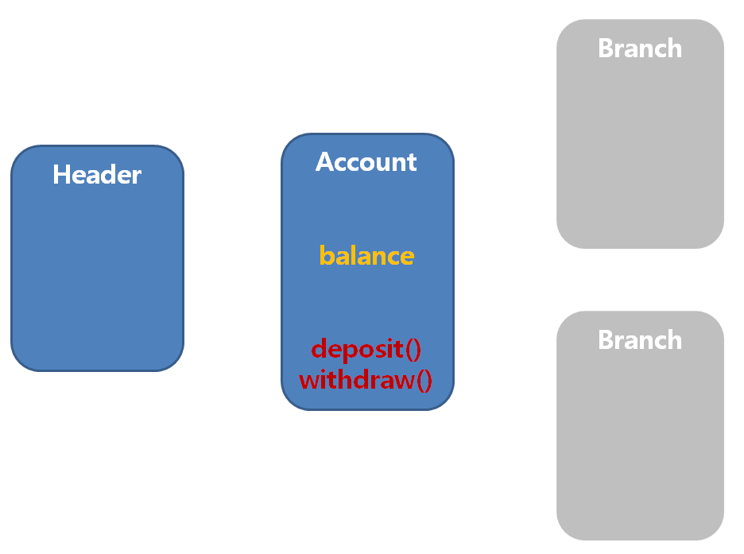

## 190918 

## 8. 쓰레드의 실행제어(p.748)

### 쓰레드 생성, 소멸 과정

1. #### NEW

- 쓰레드 생성

2. #### start()

- 쓰레드 실행

3. #### RUNNABLE

- 실행 대기열(큐)에 저장되어 차례를 기다린다.

#### 3-1. yield()

- 다른 작업에 양보한다, 이 작업은 실행대기상태가 된다.

4. #### stop()

- 쓰레드 소멸

- 과거에는 사용했지만 현재 사용 권장 않기 때문에 사용하지 않는게 좋다.

- suspend(), resume(), stop() : deprecated, 사용 권장 x


### sleep() 함수

- 일정시간동안 쓰레드를 멈추게 한다.

- sleep() -> 대기 상태 -> 다시 실행


### interrupt(), interrupted()

- 쓰레드 작업을 취소한다.

- 단지 멈추라고 요청하는 것일 뿐 쓰레드를 강제 종료시키지는 못한다.

- interrupt()는 그저 쓰레드의 interrupted상태를 바꾸는 것일 뿐이다.


#### [Inter1.java] - 인터럽트

```java
package day02;

import java.util.Scanner;

class Th1 extends Thread{	
	public void run() {
		while(!isInterrupted()) {
			//인터럽트 발생하지 않으면 계속 돔
			try {
				Thread.sleep(500);//sleep 된 상태에서 인터럽트 못 걸음
			} catch (InterruptedException e) {
				e.printStackTrace();
				return;
			}
			System.out.println("Th1");
		}
		System.out.println("Th1 END....");
	}
}

public class Inter1 {
	public static void main(String[] args) {
		Th1 th1 = new Th1();
		th1.start();
		System.out.println("END ..... ");
		
		Scanner sc = new Scanner(System.in);
		System.out.println("INPUT CMD ..... ");
		int cmd = sc.nextInt();
		if(cmd == 0) {
			th1.interrupt();
		}		
		
	}
}
```


### join()

- 다른 쓰레드의 작업이 끝날 때까지 기다린다.

Main Thread에서 2 개의 Thread를 동작하여 결과의 합을 구한다.

첫 번째 Thread는 1 ~ 100 까지의 합

두 번째 Thread는 101 ~ 150 까지의 합

두 Thread의 합을 다시 더해서 결과를 출력한다.

#### [Join.java]

```java
package day02;

class Th2 extends Thread{	
	
	int sum = 0;
	
	public int getSum() {
		return sum;
	}
	
	public void run() {
		int i = 0;
		System.out.println(isInterrupted());
		while(!isInterrupted()) {
			sum += i;
			if(i == 10) {
				return;
			}
			//인터럽트 발생하지 않으면 계속 돔
			try {
				Thread.sleep(100);//sleep 된 상태에서 인터럽트 못 걸음
			} catch (InterruptedException e) {
				e.printStackTrace();
				return;
			}
			System.out.println("Th2: " + i);
			i++;
		}
		System.out.println("Th2 END....");
	}
}

public class Join {
	public static void main(String[] args) {
		Th2 th2 = new Th2();
		System.out.println("START");
		th2.start();
		try {
			th2.join(); //th2 쓰레드가 끝날때까지 메인 쓰레드 동작안함, 기다리는 중
		} catch (InterruptedException e) {
			e.printStackTrace();
		}
		System.out.println("sum: "+ th2.getSum()+"");
	}
}

```

#### [Join2.java]

```java
package day02;

class Thread1 extends Thread{	
	int sum = 0;
	int i;
	int i2;
	
	public int getSum() {
		return sum;
	}

	public Thread1(int i, int i2) {
		this.i = i;
		this.i2 = i2;
	}
	
	public void run() {
		System.out.println(isInterrupted());
		while(!isInterrupted()) {
			sum += i;
			if(i == i2) {
				return;
			}
			i++;
		}
		System.out.println("THREAD END....");
	}
}

public class Join2 {
	public static void main(String[] args) {
		Thread1 th1 = new Thread1(1, 100);
		Thread1 th2 = new Thread1(101, 150);
		th1.start();
		th2.start();
		try {
			th1.join();
			th2.join();
		} catch (InterruptedException e) {
			e.printStackTrace();
		}
		int total = th1.getSum() + th2.getSum();
		System.out.println("Total : " + total);
	}
}
```


### suspend(), resume()

- suspend()는 sleep()처럼 쓰레드를 멈추게 한다.
- suspend()에 의해 정지된 쓰레드는 resume()을 호출해야 다시 실행대기 상태가 된다.

#### [Suspend.java]

```java
package day02;

import java.util.Scanner;

class Sus implements Runnable{

	@Override
	public void run() {
		while(true) {
			try {
				Thread.sleep(1000);
			} catch (InterruptedException e) {
				// TODO Auto-generated catch block
				e.printStackTrace();
			}
			System.out.println("-");

		}
	}
}

public class Suspend {
	String name;
	
	public static void main(String[] args) {		
			Thread t1 = null;
			Scanner sc = new Scanner(System.in);
			while(true) {
				System.out.println("input cmd ?");
				int cmd = sc.nextInt();
				if(cmd == 1) {
					t1 = new Thread(new Sus(), "s1");
					t1.start();
				}else if(cmd == 2){
					t1.suspend();
					System.out.println("Suspended");
				}else if(cmd == 3) {
					t1.resume();
				}else if(cmd == 4) {
					t1.stop();
					//stop 호출시 run 함수에서 언제 중지되든지 상관x
					//네트워크 연결이 open 되어있는 상황에서 stop 호출된다면
					//close 되지 않음
				}else if(cmd == 9) {
					return;
				}
			}
			
	}
}
```

#### [Suspend2.java]

```java
package day02;

import java.util.Scanner;

class Sus2 implements Runnable{
	
	boolean spd = false;
	boolean stp = false;
	
	public void setStop() {
		stp = true;
	}

	public void setSus() {
		spd = true;
	}

	public void setRes() {
		spd = false;
	}

	@Override
	public void run() {
		while(!stp) {
			if(!spd) {
				System.out.println("-");
			}
		}
	}
}

public class Suspend2 {
	
	public static void main(String[] args) {		
			Thread t1 = null;
			Sus2 sus2 = null;
			Scanner sc = new Scanner(System.in);
			while(true) {
				System.out.println("input cmd ?");
				int cmd = sc.nextInt();
				if(cmd == 1) {
					sus2 = new Sus2();
					t1 = new Thread(sus2, "s2");
					t1.start();
				}
				else if(cmd == 2){
					sus2.setSus();
					System.out.println("Suspended");
				}
				else if(cmd == 3) {
					sus2.setRes();
					System.out.println("Resume");

				}
				else if(cmd == 4) {
					sus2.setStop();
					
				}
				else if(cmd == 9) {
					return;
				}
			}
	}
}
```


### 쓰레드의 동기화



- 동시에 쓰레드가 실행된다면 문제가 생김
  - ex) 은행 계좌에 동시에 접근할 때, 두 명이 동시 접근하여 먼저 들어온 사람이 돈을 다 출금하여 다른 사람이 출금하지 못할 경우 문제가 생김
- 동시에 들어갈 때 그 쓰레드가 withdraw() 함수를 점유하는 것이다.
- 즉, 다른 쓰레드는 해당 함수를 실행시키지 못한다.


synchronized 키워드를 사용해서 하나의 쓰레드만 실행되어지게 할 수 있다.

여러 쓰레드가 하나의 자원을 공유하기 때문에, 쓰레드를 제어할 수 없기에 이러한 문제가 발생한다.

#### [Account.java]

```java
package bank;

public class Account {
	private int balance;

	public Account() {
		
	}
	
	public Account(int balance) {
		this.balance = balance;
	}
	
	public int getBalance() {
		return balance;
	}
	
	public void deposit(int money) throws Exception {
		//입금할 때는 -이면 exception 발생
		if(money <= 0) {
			throw new Exception();
		}
		balance += money;
		notify(); //기다리고 있는 순서대로 호출
	}
	
	public synchronized void withdraw(int money) throws Exception {
		if(balance >= money) {
			balance -= money;
		}else {
			wait(); //소멸되지 않고 wating 영역, pull영역으로
		}
	}

	@Override
	public String toString() {
		return "Account [balance=" + balance + "]";
	}
}
```

#### [Bank.java]

```java
package bank;

class Header extends Thread{
	Account acc;
	public Header(Account acc) {
		this.acc = acc;
	}
	
	public void run() {
		for(int i = 0; i < 100; i++) {
			int money = (int)(Math.random()*3+1)*80;
			try {
				Thread.sleep(80);
				acc.deposit(money);
			} catch (Exception e) {
				e.printStackTrace();
			}
		}
	}
}

class Branch extends Thread{
	Account acc;
	String name;
	
	
	public Branch(String name, Account acc) {
		this.name = name;
		this.acc = acc;
	}
	
	public void run() {
	  //while(acc.getBalance() > 0) {
		  //int money = (int)(Math.random() * 3 + 1) * 100;
		int money = 500;
		try {
			  //Thread.sleep(10);
			  acc.withdraw(money);
		  } catch (Exception e) {
			  e.printStackTrace();
		  }
		  System.out.println(name+" "+acc.getBalance());
	  //}
	}
}

public class Bank {
	public static void main(String[] args) {
		Account acc = new Account(700);
//		Header h = new Header(acc);
//		h.start();
		Branch b1 = new Branch("b1", acc);
		Branch b2 = new Branch("b2", acc);
		Branch b3 = new Branch("b3", acc);
		Branch b4 = new Branch("b4", acc);
		b1.start();
		b2.start();
		b3.start();
		b4.start();
	}
}
```