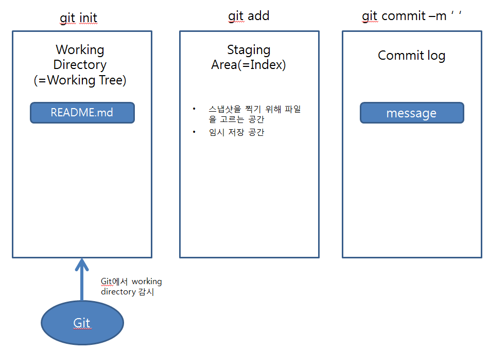
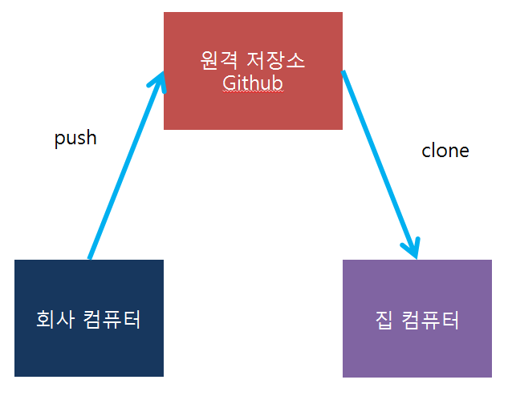
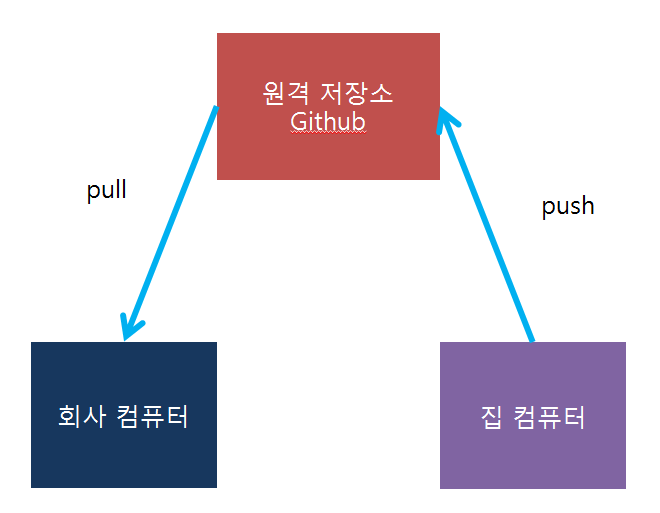
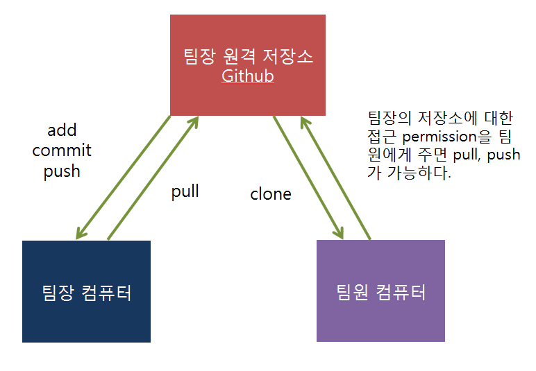
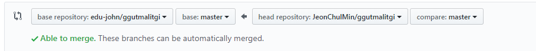

# 190905 GitHub 특강2

- GitHub Repository 각 폴더마다 README.md 파일 만들어서 이 폴더의 설명 및 어떻게 운영하겠다고 알려주는 파일 꼭 만들기.

---

< vscode 다운 >

https://code.visualstudio.com/#alt-downloads

System Installer 64bit 다운로드

next 중간에 code ~ 2개 체크하고 계속 진행하면 된다.

- VScode는 텍스트 에디터, 깃과 연동가능

```SHELL
mkdir codes
cd codes
mkdir git_basic
cd ~
code . //현재 폴더에서 작업하겠다. vscode 프로그램 열림
```

---

## Git

1. SCM (Source Code Management), VCS (Version Control), 버전 관리를 함으로써 이전 버전으로 돌아가서 수정할 수도 변경할 수도 있다.
2. 원격 저장소(git / github)
3. 협업 도구

---



---

## git init

- git init 실행시 해당 디렉터리에 .git이 생김
- 명령어 실행 이후에 해당 디렉터리 옆이 (master) 표시가 생긴다.
- (master)의 의미는 git으로 관리되어지고 있다는 것을 뜻함

### rm -rf .git 

- 깃으로 관리안할 경우, .git을 지워버리면 관리가 중지됨

- 깃을 새로 만들거나 지울 때는 .git을 지우기만 하면 된다.

---

## git status

- git은 해시를 통해서 파일이 변경 및 수정되었는지를 계속해서 감시하고 있다.
- 해당 상태가 변경되었는지를 확인하고 싶을 경우 위 명령어를 사용한다.

## git add

- git add를 통해 스냅샷을 찍을 파일을 선택할 수 있다.
- git add를 하면 staging area(임시 저장 공간)으로 이동되어진다.

## git commit

- add한 파일을 스냅샷을 찍는 단계
- 맨 처음 실행시 사용자가 누군지 모르기 때문에 아래와 같은 내용이 나온다.

```shell
$ git commit

*** Please tell me who you are.

Run

  git config --global user.email "you@example.com"
  git config --global user.name "Your Name"

to set your account's default identity.
Omit --global to set the identity only in this repository.

fatal: unable to auto-detect email address (got 'student@M60211.(none)')

 git config --global user.email " "

 git config --global user.name " "
```

- 아래와 같이 사용자 email, name을 입력해주면 된다.

```shell
git config --global user.email "이메일주소"
git config --global user.name "username"
```

- user name은 깃허브 로그인 후 오른쪽 맨 위에 클릭시 나오는 이름

## git commit -m "message"

- commit 시 무슨 파일인지 설명메시지를 함께 써주면 좋다.
- 메시지 작성시 영어로 작성
- 동사 + 목적어 (동사는 능동태로 원형 위주로 쓰는 것을 git에서 recommend)

- commit 후에는 아래와 같이 상태를 보면 working directory에 저장할 게 없다라고 나온다.

```shell
$ git status
On branch master
nothing to commit, working tree clean
```


## git log

- log 명령어는 이 때까지 commit 한 내용들을 볼 수 있다.

```shell
commit cce1e627bc4770d49692079ee54a15ce4b4df653 (HEAD -> master)
Author: jeonchulmin <jeonchulmin@naver.com>
Date:   Thu Sep 5 10:45:50 2019 +0900
first commit //message
```

- cce1e627bc4770d49692079ee54a15ce4b4df653는 해시를 나타낸다.

### 해시

 하나의 함수, 입력은 아무거나 다 가능, 결과값이 항상 2의 160승 숫자가 나옴긴 문자, 문서를 보낼 때 중간에 누가 수정할 가능성이 있음 이러한 것을 체크하기 위해 해시 함수를 이용하면 쉽게 비교할 수 있다.

 깃은 해시를 쓰기 때문에 문자 하나만 바뀌어도 status 확인하면 변화를 감지할 수 있다. 해시 숫자가 변한 것을 보고 파악하는 것이다.

## git log --oneline

- log 내용을 간단하게 한 줄로 볼 수 있다.


## git checkout [커밋해시]

- 이전 버전을 체크하고 싶을 때 , 이전 문서를 확인하고 싶을 때

```shell
$ git log --oneline
1c86a2a (HEAD -> master) finish basic command
cce1e62 first commit
```

- 앞의 7글자(해시) 넣어서 찾으면 됨, 해시의 경우 숫자의 값 범위가 크기 때문에 2글자만 바뀌어도 큰 숫자가 변경하는 것과 같다.

```shell
$ git checkout cce1e62
Note: switching to 'cce1e62'.

You are in 'detached HEAD' state. You can look around, make experimental
changes and commit them, and you can discard any commits you make in this
state without impacting any branches by switching back to a branch.

If you want to create a new branch to retain commits you create, you may
do so (now or later) by using -c with the switch command. Example:

  git switch -c <new-branch-name>

Or undo this operation with:

  git switch -

Turn off this advice by setting config variable advice.detachedHead to false

HEAD is now at cce1e62 first commit
```

- 입력하면 그 이전 버전 상태로 돌아감

- 다시 되돌아가려면

### git checkout master


## git restore [파일명]

- 맨 마지막으로 저장된 상태로 돌아갈 수 있다.


## 원격 저장소




## git remote add [원격저장소이름] [주소]

- 보통 git remote add origin [주소]

```shell
git remote add root https://github.com/JeonChulMin/basic.git
```

- 입력하면 원격 저장소 이름이 root인 원격 저장소가 생성

```shell
$ git remote -v
root    https://github.com/JeonChulMin/basic.git (fetch)
root    https://github.com/JeonChulMin/basic.git (push)
```


## git push [원격 저장소의 이름] [브랜치의 이름]

- 원격 저장소에 넣고 싶을 때

```shell
git push root master
```

- 만약 push 하는 것이 처음이라면 사용자 이름과 비밀번호를 입력하고 한다.


## git clone [깃허브 주소] [프로젝트명]

- 내 집에서 접근하고 싶을 때

```shell
cd ~
mkdir house
cd house
git clone https://github.com/JeonChulMin/basic.git
git clone https://github.com/JeonChulMin/basic.git 프로젝트명
```

- 주소만 넣으면 repository 이름의 폴더가 생기고 안에 생김

- 프로젝트명까지 넣어주면 프로젝트명으로된 폴더가 생김


## git diff

- 이전과 달리 몇 줄이 추가되었고 변경되었는지 확인할 수 있다.


## 반대로 집에서 수정 후 원격 저장소에 올리고 회사컴에서 원격저장소의 파일을 받고 싶을 때



- 집에서 clone한 문서 수정

- git remote 하면 origin이 나옴 clone하면 그 해당 정보들을 다 가져오기 때문이다.

- 복제를 했으니까 클론받은 코드는 다시 리모트 설정할 필요가 없다.

- git remote -v 하면 똑같은 주소를 가지는 것을 확인할 수 있다.

- git push origin master
  - 수정한 문서 내용을 원격 저장소에 올린다.

- 현재 회사컴에는 업데이트 안됨

#### < 회사컴 >

## git pull [이름] [브랜치이름]

- 주의할 점은 작업하는 도중에는 pull 불가능, 항상 아무것도 작업하지 않은 채로 해야한다.

```shell
$ git status
On branch master
nothing to commit, working tree clean
```

- pull 전에는 항상 git status로 위와 같이 나온 상태에서 pull 작업을 한다.

```shell
git pull root master
```

- pull 명령어를 사용해 수정된 정보를 원격 저장소로부터 가져온다.


## 협업 도구

- ### push & pull

- ### branching & request

- ### forking & pull request (=github flow)

```
cd ..
mkdir collabo
```

## push & pull



- 팀장이 원격 저장소를 하나 만든다.

- 깃허브에서 클론 해오는 것은 허가 필요없기 때문에 아무나 다 받아올 수 있다.
- 팀원은 팀장의 원격 저장소를 클론해서 가져올 수 있다.
- 하지만 문서를 수정해서 push하는 것은 불가능하다.
- 누군가 문서를 악의적으로 수정할 가능성이 있기 때문에 팀장이 팀원에게 권한을 부여해야 가능하다.

- 해당 repository 간 다음 settings - collaborators username으로 추가하고 인증해야 push, pull 가능

- 또한 repository - issues에서 게시판처럼 활용가능(피드백가능)

- 단점은 동시에 작업이 불가능하기 때문에 협업할 때에는 좋지 않고 누군가 저장소를 추가해줘야지만 사용가능하다.


## forking & pull request (=github flow)

- 관리 권한을 받지 않고 나의 코드를 반영할 수 있는 요청을 할 수 는 방법이 pull request 방법이다.

- 다른 사람의 repository를 복사해오는 것을 fork라고 한다


- clone 받을 때 깃으로 관리되고 있는 폴더에 클론하면 안된다.

- .git 안에 .git이 있으면 깃이 무엇을 관리할지 헷갈리게 됨

- fork한 후 clone 한 문서를 수정하고 나서 push 가능하다.

- 기존의 fork한 repository에는 변화가 없다.

- 만약 팀장 저장소에 적용시키고 싶다면 요청을 해야 한다.
- new pull request 버튼 클릭하여 요청을 하면 요청 완료



- 이제 팀장이 여러 요청을 보고나서 add merge 버튼을 누르면 해당 내용이 팀장 저장소에 적용된다.

- 이 방법은 권한을 주지않고도 코드에 기여가능하다.

- 오픈 소스들을 수정하거나 개선시킬 때 이런 형태로 제안을 넣게됨

1. fork
2. clone
3. code .으로 수정
4. add
5. commit -m
6. push
7. new pull request